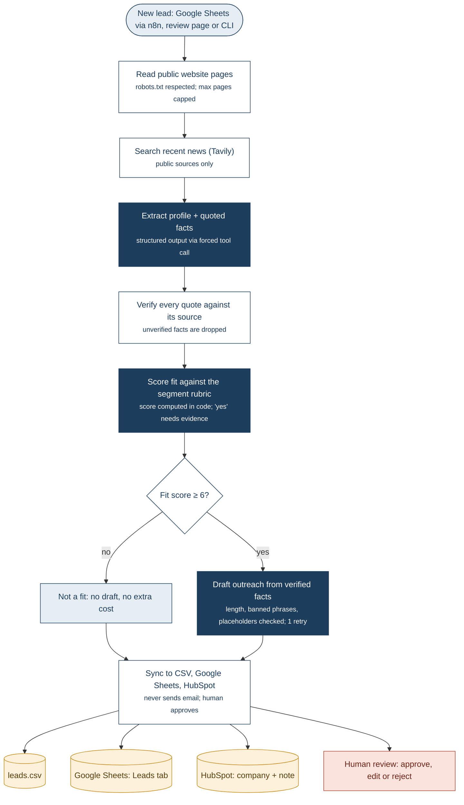
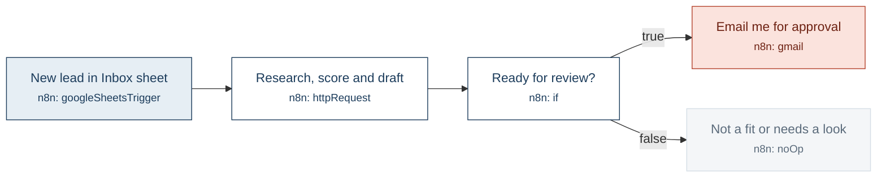

# LeadScout architecture

Generated by `python -m app.flowchart` from the pipeline code and the n8n workflow file.

## Research pipeline

```mermaid
flowchart TD
    IN(["New lead: Google Sheets via n8n, review page or CLI"])
    fetch_website["Read public website pages<br/><small>robots.txt respected; max pages capped</small>"]
    IN --> fetch_website
    search_news["Search recent news (Tavily)<br/><small>public sources only</small>"]
    fetch_website --> search_news
    extract_profile["Extract profile + quoted facts<br/><small>structured output via forced tool call</small>"]
    search_news --> extract_profile
    verify_facts["Verify every quote against its source<br/><small>unverified facts are dropped</small>"]
    extract_profile --> verify_facts
    score_fit["Score fit against the segment rubric<br/><small>score computed in code; 'yes' needs evidence</small>"]
    verify_facts --> score_fit
    draft_email["Draft outreach from verified facts<br/><small>length, banned phrases, placeholders checked; 1 retry</small>"]
    FIT{"Fit score ≥ 6?"}
    score_fit --> FIT
    FIT -- yes --> draft_email
    FIT -- no --> NF["Not a fit: no draft, no extra cost"]
    NF --> sync
    sync["Sync to CSV, Google Sheets, HubSpot<br/><small>never sends email; human approves</small>"]
    draft_email --> sync
    CSV[("leads.csv")]
    GS[("Google Sheets: Leads tab")]
    HS[("HubSpot: company + note")]
    REV["Human review: approve, edit or reject"]
    sync --> CSV
    sync --> GS
    sync --> HS
    sync --> REV

    classDef io fill:#E6EEF4,stroke:#1D3D5C,color:#1D3D5C
    classDef ai fill:#1D3D5C,stroke:#1D3D5C,color:#FFFFFF
    classDef code fill:#FFFFFF,stroke:#1D3D5C,color:#1D3D5C
    classDef store fill:#FDF1DC,stroke:#C98A12,color:#5A3E08
    classDef human fill:#FBE3DD,stroke:#B5452F,color:#6E2213
    classDef ok fill:#E3F1EA,stroke:#2E7D5B,color:#174A33
    classDef warn fill:#FDF1DC,stroke:#C98A12,color:#5A3E08
    classDef bad fill:#FBE3DD,stroke:#B5452F,color:#6E2213
    classDef skip fill:#F4F6F8,stroke:#D5DEE6,color:#5B6B7B
    class IN,NF io
    class draft_email,extract_profile,score_fit ai
    class fetch_website,search_news,verify_facts,sync,FIT code
    class CSV,GS,HS store
    class REV human
```

## n8n workflow

```mermaid
flowchart LR
    N0["New lead in Inbox sheet<br/><small>n8n: googleSheetsTrigger</small>"]
    N1["Research, score and draft<br/><small>n8n: httpRequest</small>"]
    N2["Ready for review?<br/><small>n8n: if</small>"]
    N3["Email me for approval<br/><small>n8n: gmail</small>"]
    N4["Not a fit or needs a look<br/><small>n8n: noOp</small>"]
    N0 --> N1
    N1 --> N2
    N2 -- true --> N3
    N2 -- false --> N4

    classDef io fill:#E6EEF4,stroke:#1D3D5C,color:#1D3D5C
    classDef ai fill:#1D3D5C,stroke:#1D3D5C,color:#FFFFFF
    classDef code fill:#FFFFFF,stroke:#1D3D5C,color:#1D3D5C
    classDef store fill:#FDF1DC,stroke:#C98A12,color:#5A3E08
    classDef human fill:#FBE3DD,stroke:#B5452F,color:#6E2213
    classDef ok fill:#E3F1EA,stroke:#2E7D5B,color:#174A33
    classDef warn fill:#FDF1DC,stroke:#C98A12,color:#5A3E08
    classDef bad fill:#FBE3DD,stroke:#B5452F,color:#6E2213
    classDef skip fill:#F4F6F8,stroke:#D5DEE6,color:#5B6B7B
    class N0 io
    class N1,N2 code
    class N3 human
    class N4 skip
```
